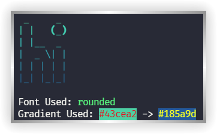
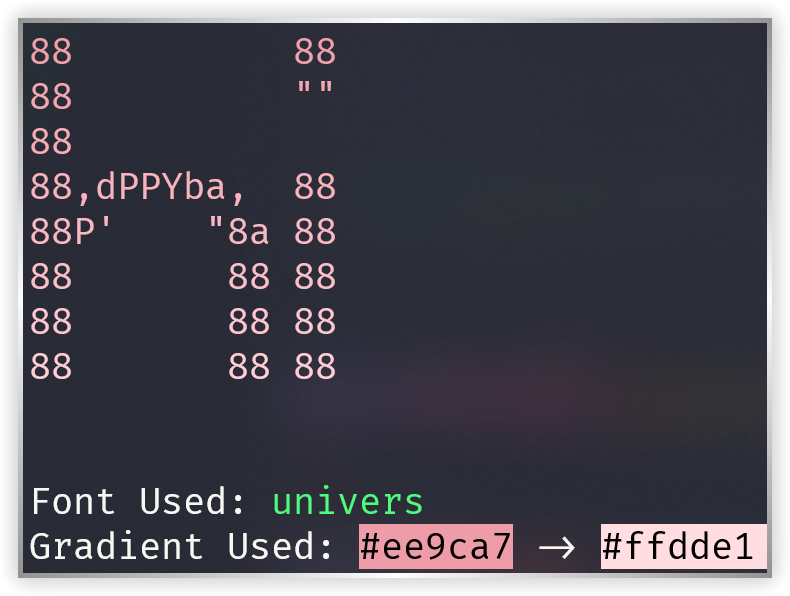
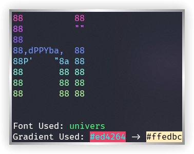
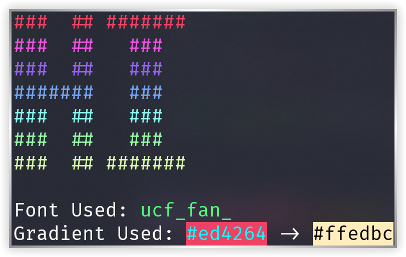
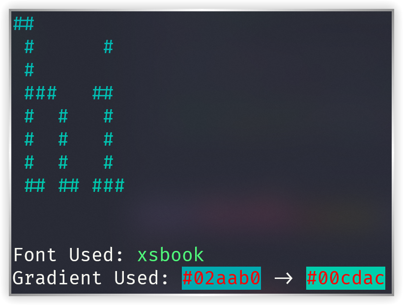
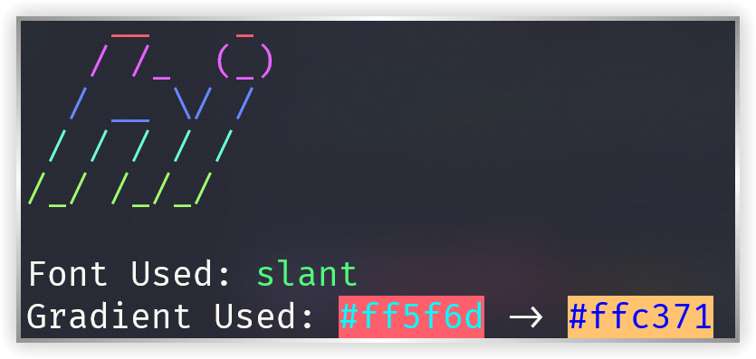

# gradient_figlet

Prints gradient figlets using [rich](https://github.com/Textualize/rich "Rich is a Python library for rich text and beautiful formatting in the terminal.") and [pyfiglet](https://github.com/pwaller/pyfiglet "An implementation of figlet written in Python.")

## Screenshots

